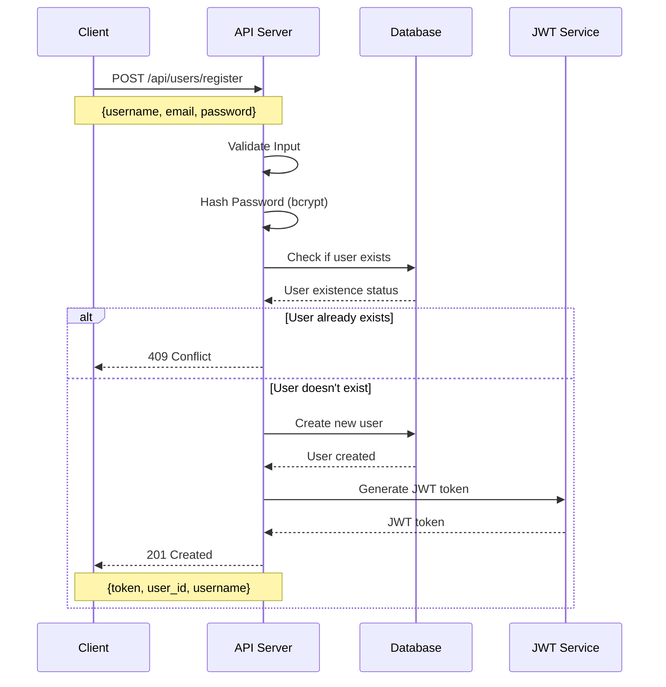
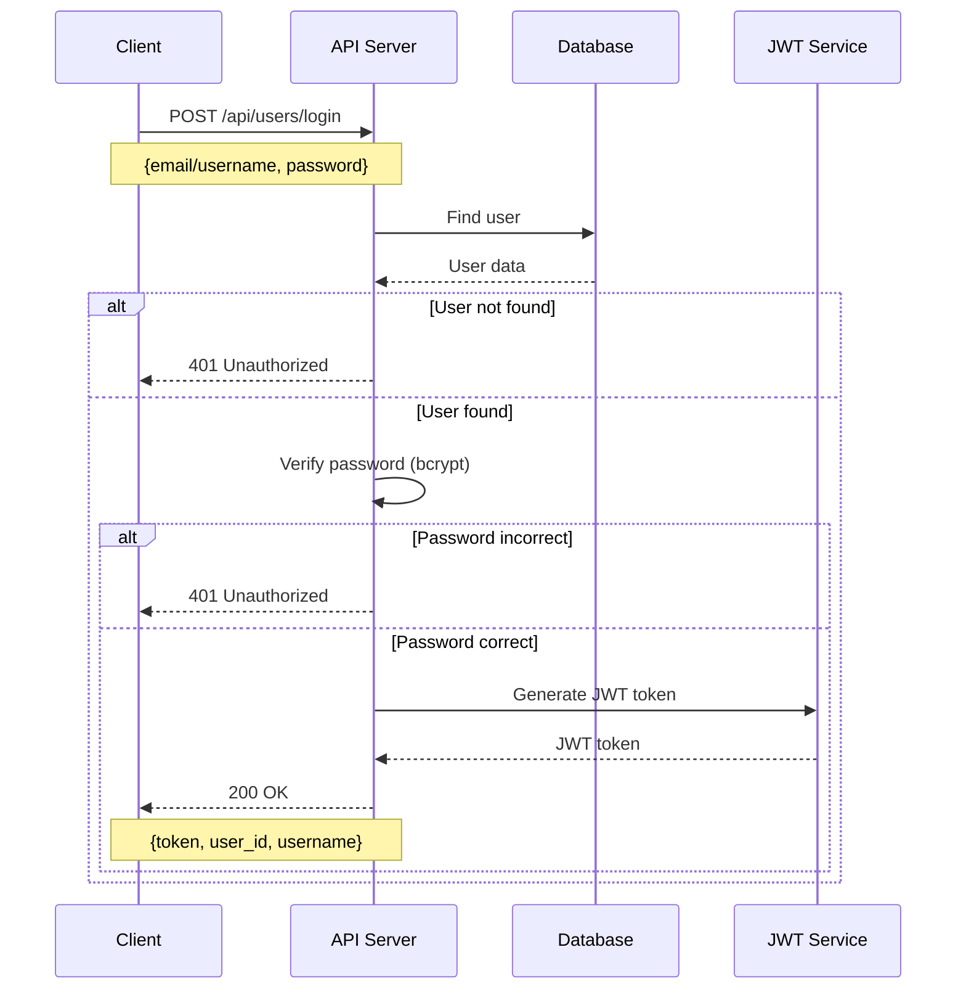
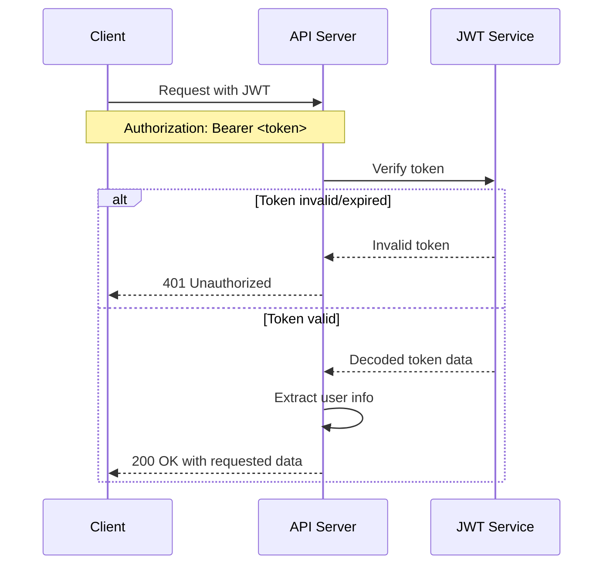
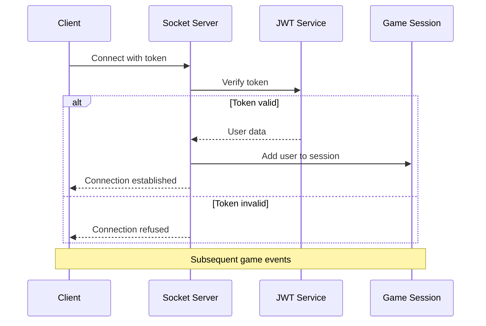

# Authentication Flow Documentation

## Overview

This document details the authentication flows implemented in our application, including user registration, login, and session management using JWT (JSON Web Tokens).

## 1. User Registration Flow



## 2. User Login Flow



## 3. Session Management Flow



## 4. Socket Authentication Flow



## Implementation Details

### Security Measures

1. Passwords are hashed using bcrypt before storage
2. JWT tokens expire after 7 days
3. All sensitive routes require valid JWT tokens
4. HTTPS is enforced for all API endpoints
5. Rate limiting is implemented for login attempts

### JWT Token Structure

```json
{
  "user_id": "uuid",
  "username": "string",
  "iat": "timestamp",
  "exp": "timestamp"
}
```

### Error Handling

- Invalid credentials: 401 Unauthorized
- User already exists: 409 Conflict
- Invalid token: 401 Unauthorized
- Server errors: 500 Internal Server Error

### API Endpoints

- POST /api/users/register - User registration
- POST /api/users/login - User login
- POST /api/users/logout - User logout (token invalidation)
- GET /api/users/me - Get user profile (authenticated)
- PUT /api/users/profile - Update user profile (authenticated)

## Best Practices

1. Tokens are stored securely in client-side storage
2. Sensitive data is never logged
3. Failed login attempts are monitored
4. Password requirements are enforced
5. Cross-Origin Resource Sharing (CORS) is properly configured
