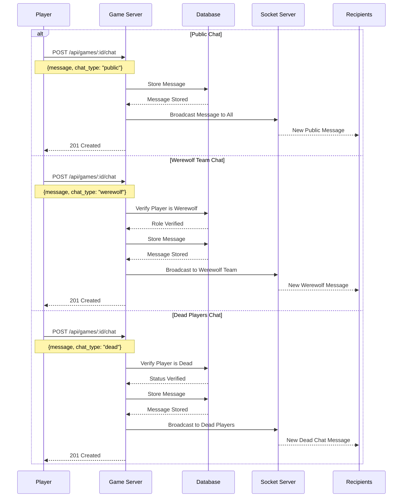
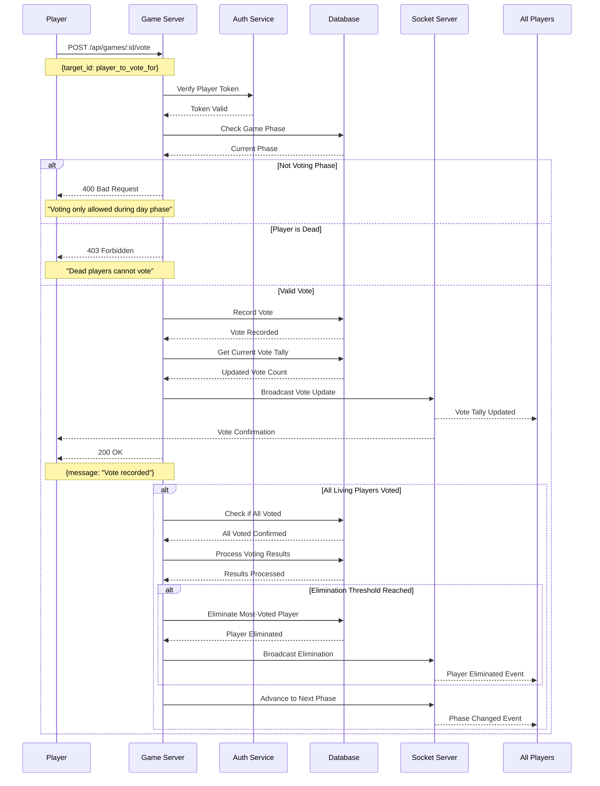
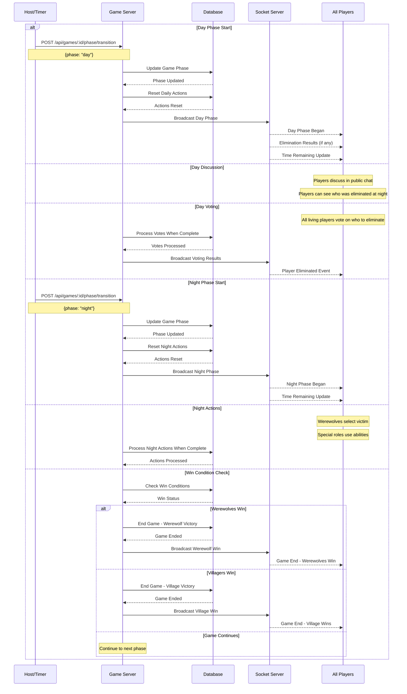
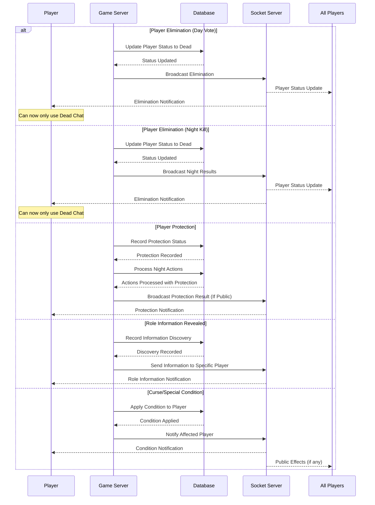

# Communication, Voting, and Game Progression Flow

## Overview

This document details the flow of player communication, voting mechanics, and game progression systems in the Werewolf game.

## 1. Communication System Flow

### User-Friendly Explanation

The chat system works differently depending on who you want to talk to:

1. **Public Chat (Day Phase)**

   - Everyone can see and send messages
   - Your messages show your username and are visible to all players
   - Perfect for discussing who might be a werewolf

2. **Werewolf Team Chat (Night Phase)**

   - Only available to players with the Werewolf role
   - Allows werewolves to secretly coordinate their strategy
   - Other players cannot see these messages
   - System automatically checks you're a werewolf before sending

3. **Dead Players Chat**
   - Once eliminated, you can only chat with other dead players
   - Living players cannot see these messages
   - You can discuss the game freely without influencing living players
   - System verifies you're actually dead before allowing messages

Messages are delivered instantly to all appropriate recipients through your game connection.

## 2. Voting System Flow

### User-Friendly Explanation

The voting system determines who gets eliminated during the day phase:

1. **Casting a Vote**

   - You can only vote during the day phase
   - Click on another player to select them for elimination
   - Dead players cannot participate in voting
   - You can change your vote as many times as you want until voting ends

2. **Vote Tracking**

   - Everyone can see how many votes each player has received
   - The game shows a live tally that updates instantly when anyone votes
   - You can see who's in danger of elimination

3. **Vote Resolution**

   - When all living players have voted (or the timer expires)
   - The player with the most votes is eliminated
   - In case of a tie, a random player among those tied is eliminated
   - The eliminated player cannot participate in future day activities but joins the dead chat

4. **Special Voting Rules**
   - Some roles may have double votes or veto powers
   - Protection abilities may save a player from elimination

## 3. Game Progression Flow

### User-Friendly Explanation

The game progresses through alternating day and night phases:

1. **Day Phase**

   - **Discussion Period**: All living players can chat in the public channel
   - **Information Sharing**: Players learn who was eliminated during the night
   - **Voting Period**: Everyone votes on who to eliminate
   - **Elimination**: The player with the most votes is removed from the game
   - Day phases typically last 3-5 minutes

2. **Night Phase**

   - **Werewolf Action**: Werewolves choose a victim to eliminate
   - **Special Role Actions**: Other roles use their abilities
     - Seer: Investigate one player to learn their role
     - Doctor: Protect one player from elimination
     - Other roles: Use their unique abilities
   - All actions are secret until results are revealed the next day
   - Night phases typically last 1-2 minutes

3. **Game End Conditions**

   - **Werewolves Win** when they equal or outnumber villagers
   - **Villagers Win** when all werewolves are eliminated
   - The game automatically checks for win conditions after each phase
   - When a win condition is met, all players are shown the results

4. **Phase Transitions**
   - Each phase has a timer showing time remaining
   - When timer expires or all players submit actions, the game automatically moves to the next phase
   - Phase transitions are announced to all players

## 4. Player Status Tracking

### User-Friendly Explanation

The game keeps track of all players' current status and conditions:

1. **Alive/Dead Status**

   - Your status changes to "Dead" if eliminated by voting or night actions
   - Dead players:
     - Cannot vote or use abilities
     - Can only communicate in the dead chat
     - Can see all players' roles
     - Stay in the game as observers until it ends

2. **Protection Status**

   - If protected by a Doctor or similar role, you'll survive one attack
   - Protection only lasts for one night
   - You'll be notified if you were targeted but saved
   - Other players typically don't know who was protected

3. **Role Information**

   - Investigators (like the Seer) receive information about other players
   - The system privately notifies you about what you've discovered
   - You can share this information during the day, but others may not believe you

4. **Special Conditions**
   - Some abilities may apply temporary effects to players:
     - Silence: Cannot speak during the next day
     - Curse: Changes your abilities or win conditions
     - Disguise: Makes you appear as a different role
   - Effects are tracked automatically and applied at appropriate times
   - You'll receive notifications about any conditions affecting you

All status changes happen automatically based on game actions and are instantly synced to all players who need to know.
