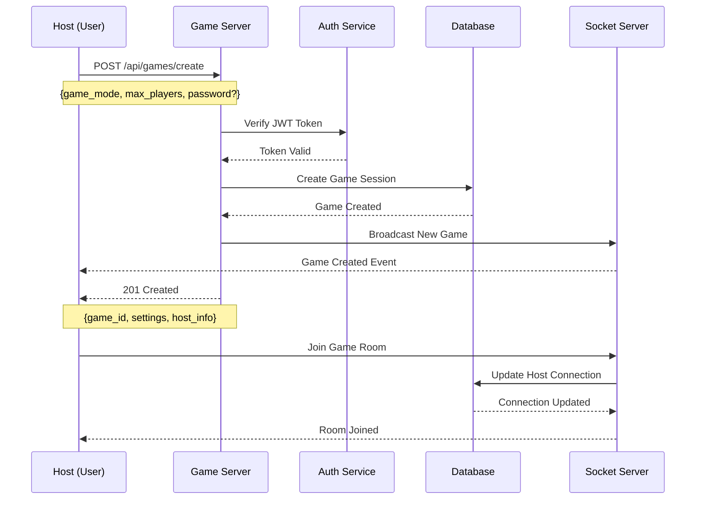
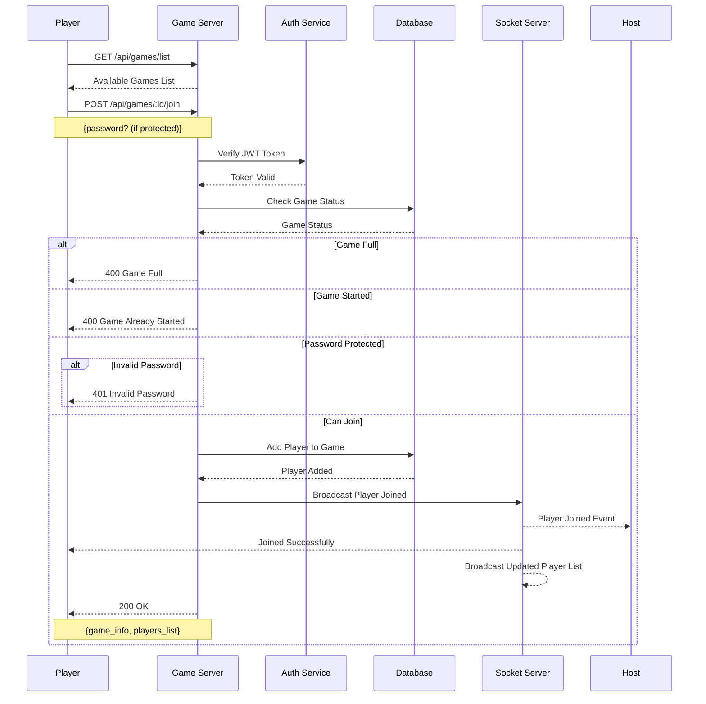
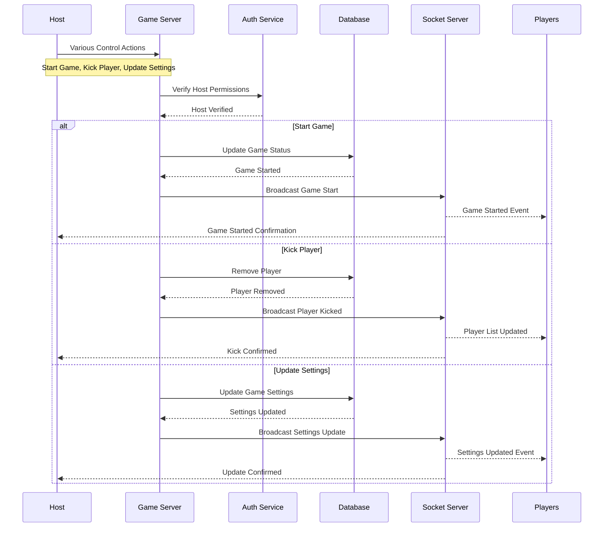
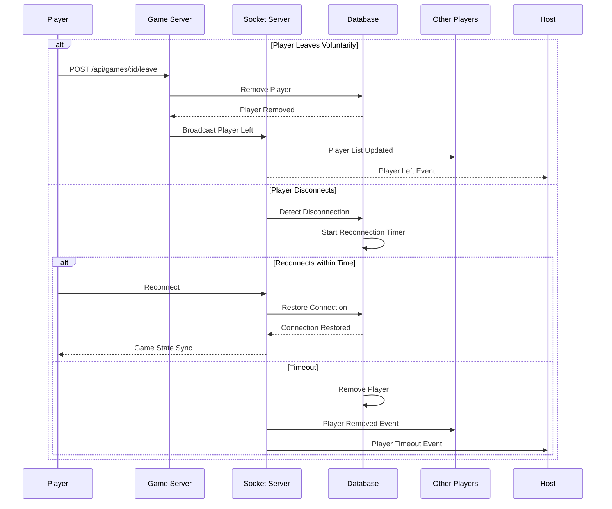

# Game Session Management Flow

## Overview

This document details the game session management flows, including game creation, lobby management, and player interactions.

## 1. Game Creation Flow

## 2. Game Lobby Management Flow

## 3. Host Controls Flow

## 4. Player Management Flow

## Implementation Details

### Game States

1. LOBBY - Initial state, players can join/leave
2. STARTING - Brief transition state when game is about to begin
3. IN_PROGRESS - Game is ongoing
4. FINISHED - Game has ended

### Security Measures

1. Host authentication for control actions
2. Password protection for private games
3. Player limit enforcement
4. Anti-cheat measures for disconnections
5. Rate limiting for join/leave actions

### Error Handling

- Game Full: 400 Bad Request
- Invalid Password: 401 Unauthorized
- Game Not Found: 404 Not Found
- Not Host: 403 Forbidden
- Server Error: 500 Internal Server Error

### Best Practices

1. Graceful handling of disconnections
2. Real-time state synchronization
3. Host migration capabilities
4. Game state persistence
5. Proper cleanup of abandoned games

## Common User Guide

### Creating a Game

1. Click "Create Game" button
2. Choose game settings:
   - Select game mode
   - Set maximum players (8-15)
   - Optional: Set password for private game
3. Click "Create" to start the lobby

### Joining a Game

1. Browse available games in the list
2. Click "Join" on your chosen game
3. Enter password if required
4. Wait in lobby for game to start

### Host Controls

As a host, you can:

- Start the game when enough players join
- Kick inactive or disruptive players
- Update game settings before start
- Transfer host status to another player

### Player Actions

As a player, you can:

- Join/Leave games freely in lobby
- See other players' status
- Chat in game lobby
- Ready up for game start
- Reconnect if disconnected
